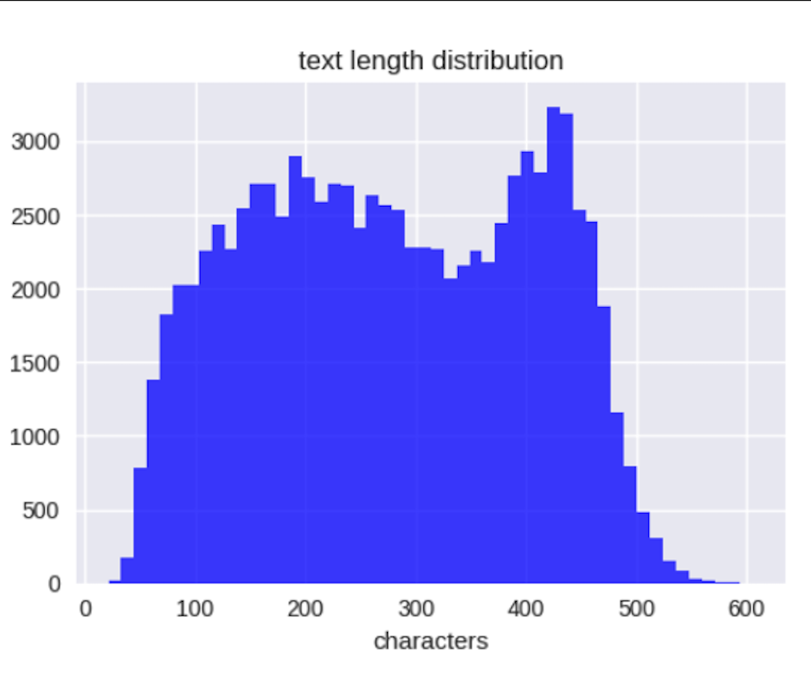
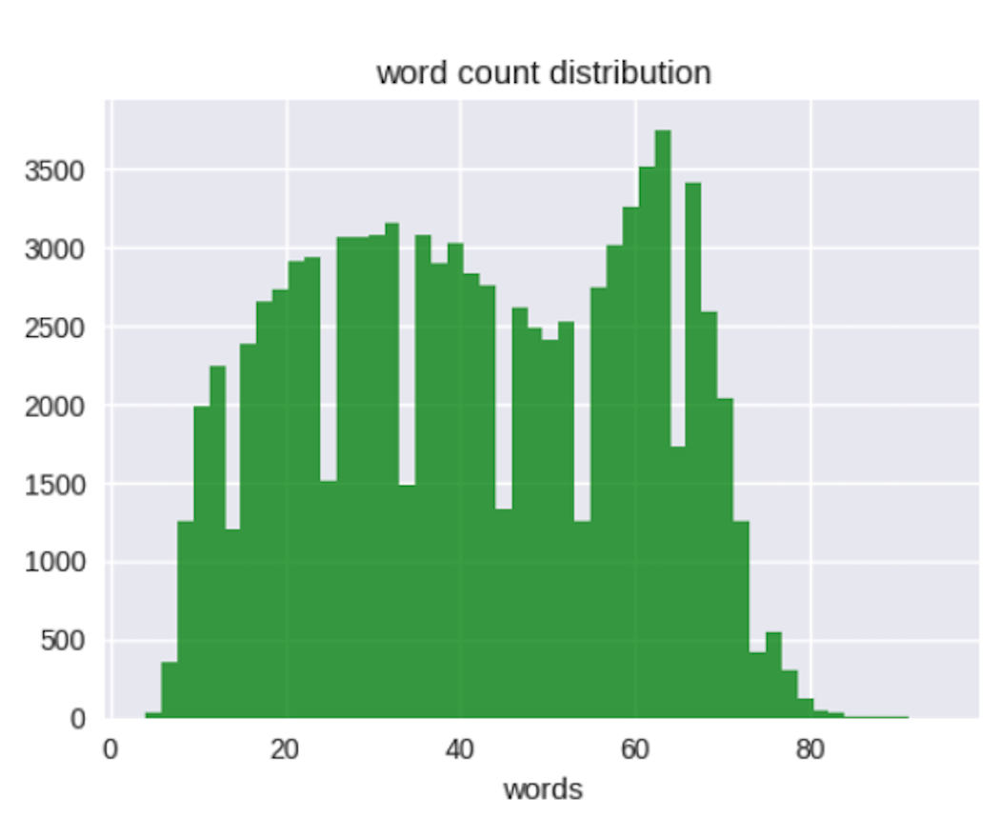
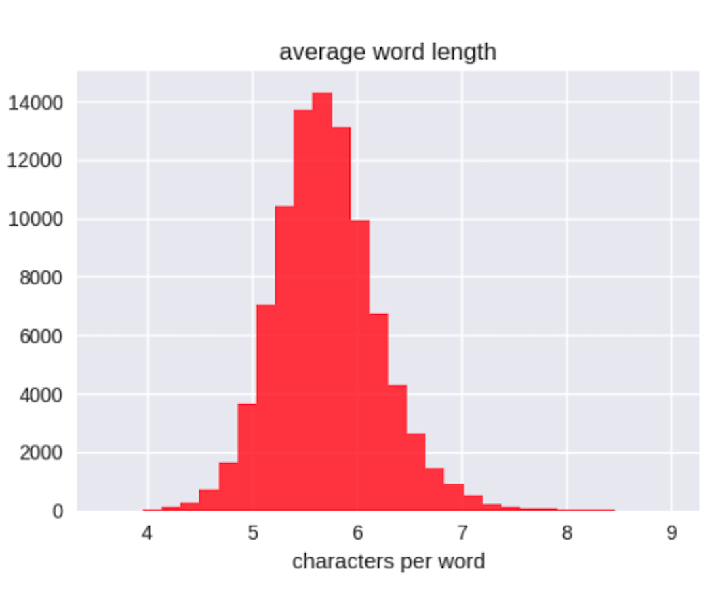
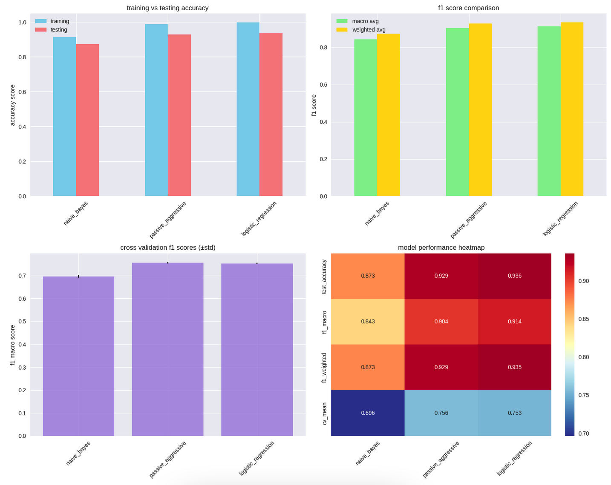

# Medical Condition Predictor via Math Algorithms

## Project Description

This project develops a robust text classification system to predict 46 medical conditions from patient reviews using a various mathematical algorithms, with the Logistic Regression model achieving a test accuracy of 93.57%. It employs advanced text preprocessing, TF-IDF vectorization, and parallel processing to optimize performance, developed as part of computational data science studies focusing on natural language processing, mathematics, and machine learning.

## Table of Contents
- [Installation](#installation)
- [Usage](#usage)
- [Features](#features)
- [Methodology](#methodology)
- [Results](#results)
- [References](#references)
- [Dependencies](#dependencies)
- [Algorithms/Mathematical Concepts Used](#algorithmsmathematical-concepts-used)
- [License](#license)
- [Acknowledgments](#acknowledgments)
- [Data Source](#data-source)
- [Note](#note)

---

## Installation

1. Install required dependencies:
```bash
pip install -r requirements.txt
```

2. The requirements.txt must include:
```
- pandas>=1.3.0
- numpy>=1.21.0
- scikit-learn>=1.0.0
- beautifulsoup4>=4.9.0
- spacy>=3.0.0
- nltk>=3.6.0
- joblib>=1.0.0
- tqdm>=4.60.0
- matplotlib>=3.5.0
- seaborn>=0.11.0
```

3. Download the dataset from [UCI Machine Learning Repository](https://archive.ics.uci.edu/).

## Usage

**Important**: Download the trained model and vectorizer from [Github](https://github.com/shreeshb51/medical_condition_predictor_via_math_algorithms).

### Running in Jupyter Notebook
1. Open a Jupyter Notebook in your environment.
2. Load the model and vectorizer:
```python
import joblib
from final import predict_condition_with_confidence

model = joblib.load('medical_condition_predictor_logistic_regression.pkl')
vectorizer = joblib.load('tfidf_vectorizer.pkl')
```
3. Make predictions:
```python
text = 'Patient review text describing symptoms'
result = predict_condition_with_confidence(model, vectorizer, text)
print(f"Predicted condition: {result['prediction']}, Confidence: {result['confidence']:.3f}")
```

## Features

- **Multi-class Classification**: Predicts 46 distinct medical conditions from text reviews
- **Advanced Preprocessing**: Removes HTML tags, stopwords, punctuation, and non-alphabetic characters
- **Parallel Processing**: Utilizes multiprocessing for efficient text cleaning
- **Ensemble Modeling**: Combines Naive Bayes, Passive Aggressive, and Logistic Regression with a stacking classifier
- **Feature Extraction**: TF-IDF vectorization with additional text metrics (length, word count, average word length)
- **Comprehensive Evaluation**: Includes accuracy, F1 scores, cross-validation, and visualization dashboards
- **Model Persistence**: Saves trained model and vectorizer for deployment

## Methodology

### 1. Data Loading and Validation

- Load datasets: 161,297 training and 53,766 testing samples
- Filter for 46 target conditions (e.g., Anxiety, Depression, Pain)
- Remove duplicates and missing values, validate dataset integrity
- Final dataset: 64,191 training, 28,038 testing samples

### 2. Data Preprocessing

- Clean text: Remove HTML tags, quotes, non-alphabetic characters, and punctuation
- Apply stopword removal and lowercase conversion
- Remove outliers based on text length (88–772 characters)
- Parallel text cleaning using multiprocessing (4 CPU cores)

### 3. Feature Extraction

- TF-IDF vectorization: max_features=20,000, ngram_range=(1,2), max_df=0.85, sublinear_tf=True
- Extract text features: text length, word count, average word length
- Combine features for train and test sets

### 4. Model Architecture

- **Naive Bayes**: MultinomialNB (alpha=0.1, fit_prior=False)
- **Passive Aggressive**: C=0.05, squared_hinge loss, max_iter=50
- **Logistic Regression**: C=20, l2 penalty, lbfgs solver, max_iter=800
- **Stacking Ensemble**: Combines above models with Logistic Regression as meta-learner
- Cross-validation: 5-fold stratified K-fold, random_state=42

### 5. Training Configuration

- Optimizer: GridSearchCV with F1 macro scoring
- Parallel processing: n_jobs=-1 for efficiency
- Training time: ~30 minutes for all models
- Best model selection based on test accuracy

### 6. Model Evaluation
- **Logistic Regression**:
  - Test accuracy: 93.57%
  - F1 macro: 91.41%
  - F1 weighted: 93.53%
  - CV mean (F1 macro): 75.30% ± 0.24%
- Demonstration accuracy: 62.5% (5/8 test cases)

| *Text Length Distribution* |
|:--:|
|  |

| *Word Count Distribution* |
|:--:|
|  |

| *Average Word Length Distribution* |
|:--:|
|  |

## Results

### Model Performance Summary

| Model | Train Accuracy | Test Accuracy | F1 Macro | F1 Weighted | CV Mean | CV Std |
|-------|----------------|---------------|----------|-------------|---------|--------|
| Logistic Regression | 99.92% | 93.57% | 91.41% | 93.53% | 75.30% | 0.24% |
| Passive Aggressive | 98.93% | 92.92% | 90.39% | 92.85% | 75.61% | 0.31% |
| Stacking Ensemble | 97.94% | 92.64% | 90.62% | - | - | - |
| Naive Bayes | 91.60% | 87.30% | 84.31% | 87.31% | 69.64% | 0.60% |

| *Model Performance Plots* |
|:--:|
|  |

### Error Analysis

- Misclassifications:
  - Back Pain predicted as Chronic Pain
  - Migraine predicted as Depression
  - Bronchitis predicted as Cough
- Demonstration accuracy: 62.5% (5/8 correct), indicating challenges with symptom overlap
- Common errors due to similar symptom descriptions across conditions

### Robustness Testing

- Stable performance across text lengths (88–772 characters)
- Lower accuracy in demonstration cases due to ambiguous symptom descriptions
- Model performs well on clean, well-structured reviews but struggles with nuanced cases

## Dependencies

- pandas>=1.3.0
- numpy>=1.21.0
- scikit-learn>=1.0.0
- beautifulsoup4>=4.9.0
- spacy>=3.0.0
- nltk>=3.6.0
- joblib>=1.0.0
- tqdm>=4.60.0
- matplotlib>=3.5.0
- seaborn>=0.11.0

## Algorithms/Mathematical Concepts Used

### 1. TF-IDF Vectorization

- **Formulation**:  
  $$\text{TF-IDF}(t,d) = \text{TF}(t,d) \cdot \log\left(\frac{N}{\text{DF}(t)}\right)$$
- Transforms text into numerical features, emphasizing rare but informative terms.

### 2. Naive Bayes

- **Bayes' Theorem**:  
  $$P(y|x) = \frac{P(x|y)P(y)}{P(x)}$$
- Assumes feature independence, suitable for text classification.

### 3. Passive Aggressive Classifier

- **Loss Function**:  
  $$L = \max(0, \, 1 - y \cdot \text{prediction})$$
- Aggressively updates weights for misclassified samples.

### 4. Logistic Regression

- **Sigmoid Function**:  
  $$\sigma(z) = \frac{1}{1 + e^{-z}}$$
- Optimizes log-loss for multi-class classification using **lbfgs** solver.

### 5. Stacking Ensemble

- Combines base model predictions using Logistic Regression as meta-learner.
- Enhances performance by leveraging strengths of individual models.

### 6. Cross-Validation

- **Stratified K-Fold**: Maintains class distribution across 5 folds for robust evaluation.

### 7. Grid Search

- Optimizes hyperparameters to maximize F1 macro score.

## References

1. Pedregosa, F., et al. (2011). Scikit-learn: Machine Learning in Python. *Journal of Machine Learning Research*, 12, 2825-2830.
2. Manning, C. D., Raghavan, P., & Schütze, H. (2008). *Introduction to Information Retrieval*. Cambridge University Press.
3. Bird, S., Klein, E., & Loper, E. (2009). *Natural Language Processing with Python*. O'Reilly Media.
4. Rennie, J. D., et al. (2003). Tackling the Poor Assumptions of Naive Bayes Text Classifiers. *ICML*.

## Data Source

Dataset: [Direct Link](https://archive.ics.uci.edu/ml/machine-learning-databases/00462/drugsCom_raw.zip)
- **Classes**: 46 medical conditions (e.g., Anxiety, Depression, Pain)
- **Format**: Text reviews
- **Size**: 92,229 total samples (64,191 train, 28,038 test)
- **Avg samples per condition**: ~2,005
- **Range**: 61–16,793 samples per condition

## License

This project is licensed under the MIT License - see the [LICENSE](LICENSE) file for details.

## Acknowledgments

- Kaggle community for providing the dataset
- Scikit-learn team for robust machine learning tools
- NLTK and spaCy communities for NLP frameworks
- Academic advisors and peers for guidance and feedback

## Note

| AI was used to generate most of the docstrings and inline comments in the code. |
|:--:|
